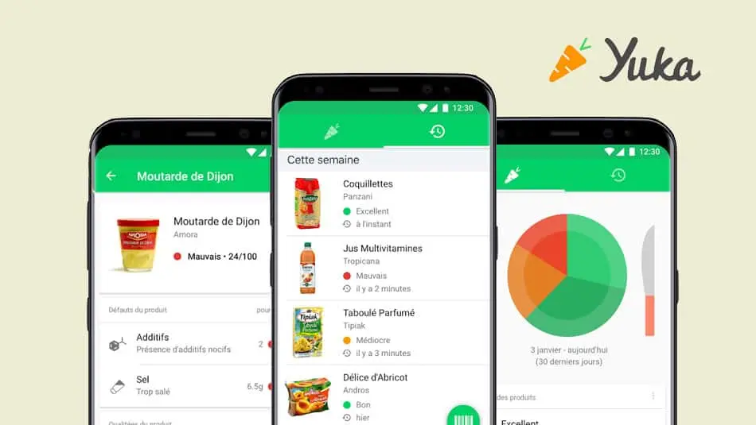

# 🥗 Yuka Clone - Food Scanner App


A complete clone of the popular **Yuka** food scanning app built with Expo and React Native. Scan product barcodes to get nutritional information and health scores.

<p align="center">
  
</p>

## ✨ Features

- 📸 **Barcode Scanner** - Scan EAN13/EAN8 barcodes with camera
- 🍎 **Nutritional Analysis** - Get detailed nutritional info from [Open Food Facts](https://world.openfoodfacts.org/)
- 📊 **Health Score** - Calculate product health score (0-100)
- 💾 **Local Storage** - Save scanned products with AsyncStorage
- 📱 **Product List** - View all previously scanned items
- 🔍 **Product Details** - See complete nutritional breakdown
- ✅ **Good/Bad Nutrients** - Visual indicators for healthy/unhealthy components
- 🎨 **Clean UI** - Smooth navigation with Expo Router

## 📱 Screenshots

_Scanner Screen → Product List → Product Details_

## 🚀 Quick Start

### Prerequisites

- Node.js 18+
- Expo CLI
- Physical device (camera required)

### Installation

```bash
git clone https://github.com/faridrehila/yuka-clone-expo.git
cd yuka-clone-expo
npm install
```

### Run the App

```bash
# iOS
npx expo run:ios

# Android
npx expo run:android
```

> ⚠️ **Camera permissions required**. The app will request access on first launch.

## 🏗️ Architecture

### File Structure

```
yuka-clone-expo/
├── app/
│   ├── (tabs)/
│   │   ├── index.tsx       # Product list screen
│   │   └── explore.tsx     # Scanner screen
│   └── modal.tsx           # Product detail screen
├── components/
│   ├── NutrimentItem.tsx   # Nutrient display component
│   └── ...
└── constants/
    └── Data.ts             # Nutrient thresholds
```

### Key Technologies

- **Expo Router** - File-based navigation
- **Expo Camera** - Barcode scanning
- **AsyncStorage** - Local data persistence
- **Axios** - API requests to Open Food Facts
- **TypeScript** - Type safety

## 🔧 How It Works

### 1. Barcode Scanning

```typescript
<CameraView
  barcodeScannerSettings={{
    barcodeTypes: ["ean13", "ean8"],
  }}
  onBarcodeScanned={handleScan}
/>
```

### 2. Fetch Product Data

```typescript
const response = await axios.get(
  `https://world.openfoodfacts.org/api/v3/product/${barcode}.json?lc=fr`
);
```

### 3. Calculate Health Score

```typescript
const score = Math.round(
  (product.nutriments.energy_100g +
   product.nutriments.fat_100g +
   product.nutriments.carbohydrates_100g +
   // ... other nutrients
  ) / 100
);
```

### 4. Save Locally

```typescript
await AsyncStorage.setItem("products", JSON.stringify(products));
```

## 📊 Nutrient Analysis

Products are analyzed based on:

- ✅ **Good nutrients** (below threshold): Fiber, Proteins
- ❌ **Bad nutrients** (above threshold): Sugar, Salt, Saturated Fat

Thresholds are defined in `constants/Data.ts`:

```typescript
export const DATA = {
  sugars_100g: { name: "Sucres", limit: 10, unit: "g" },
  salt_100g: { name: "Sel", limit: 1.5, unit: "g" },
  // ...
};
```

## 🎓 What You'll Learn

Building this project teaches:

- ✅ Camera API & barcode scanning
- ✅ Working with external APIs (Open Food Facts)
- ✅ Local data persistence with AsyncStorage
- ✅ File-based routing with Expo Router
- ✅ TypeScript in React Native
- ✅ FlatList optimization
- ✅ Modal navigation patterns

## 🔄 API Reference

This app uses the **Open Food Facts API**:

```
GET https://world.openfoodfacts.org/api/v3/product/{barcode}.json
```

Response includes:

- Product name & brands
- Image URL
- Detailed nutriments (per 100g)
- Ingredients list
- Allergens

[API Documentation](https://openfoodfacts.github.io/openfoodfacts-server/api/)

## 🚧 Potential Improvements

Ideas for extending this app:

- [ ] Add search by product name
- [ ] Implement user authentication
- [ ] Save favorites
- [ ] Compare multiple products
- [ ] Add offline mode
- [ ] Scan history statistics
- [ ] Share products with friends
- [ ] Dark mode support

## 🎓 Part of React Académie

This project is a practical exercise for **[React Académie](https://rn.reactacademie.fr?ref=github)** students learning React Native and Expo.

**Perfect for learning:**

- Camera integration
- API consumption
- Local storage
- Navigation patterns
- TypeScript best practices

## 🏗️ Used in Production

Similar barcode scanning patterns are used in **[Love Album](https://love-album.com?ref=github)** for QR code scanning at wedding events.

## 🤝 Contributing

Improvements welcome! Feel free to:

- Report bugs
- Suggest features
- Submit pull requests

## 📝 License

MIT

## 🙏 Credits

- Product data from [Open Food Facts](https://world.openfoodfacts.org/)
- Inspired by the original [Yuka app](https://yuka.io/)

## 💬 Questions?

Open an issue or reach out on [X/Twitter](https://x.com/faridrehila)

---

<p align="center">
  ⭐ Star this repo if you're learning React Native!
</p>
